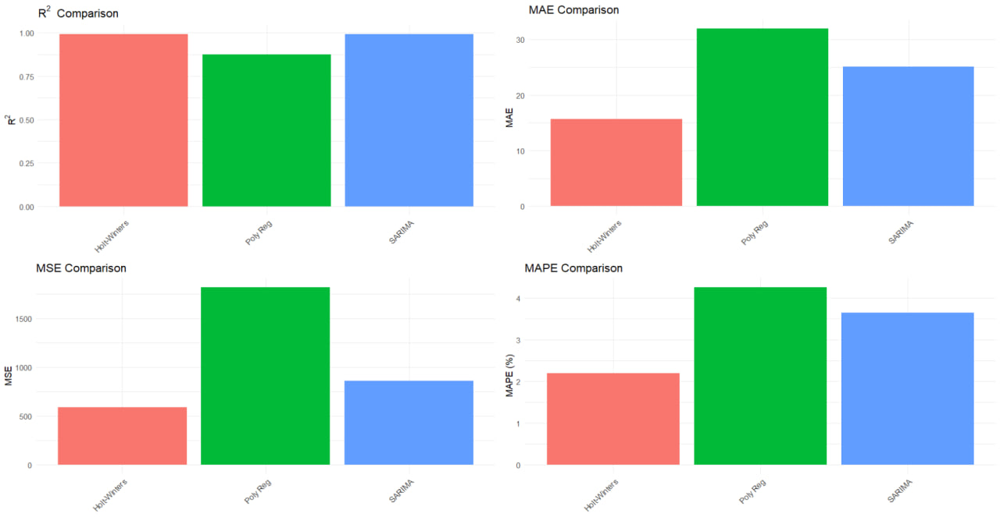

# Time Series Analysis of Truck Sales Data

This repository contains a comprehensive time series analysis of truck sales data, using various statistical and machine learning models to forecast trends and patterns. The project explores Holt-Winters Exponential Smoothing, Polynomial Regression, and SARIMA models, and evaluates their performance using appropriate metrics.

## Dataset

The data used in this project is a publicly available dummy truck sales dataset, sourced from Kaggle.\
Dataset Source: [Dummy Truck Sales Data on Kaggle](https://www.kaggle.com/datasets/ddosad/dummy-truck-sales-for-time-series/data)

## Models and Methodology

The following models were implemented and analyzed:

1. Holt-Winters Exponential Smoothing
   - Captures trends and seasonality in the data.
   - Suitable for seasonal time series forecasting.
2. Polynomial Regression
   - A machine learning approach that fits a polynomial curve to the data.
   - Useful for capturing non-linear trends.
3. SARIMA (Seasonal Autoregressive Integrated Moving Average)

   - A statistical model designed for seasonal and non-seasonal time series data.
   - Incorporates autoregression, differencing, and moving averages.

## Model Evaluation

Each model was evaluated using the following metrics:

- R-squared (R²)
- Mean Absolute Error (MAE)
- Mean Squared Error (MSE)
- Root Mean Squared Error (RMSE)
- Mean Absolute Percentage Error (MAPE)

